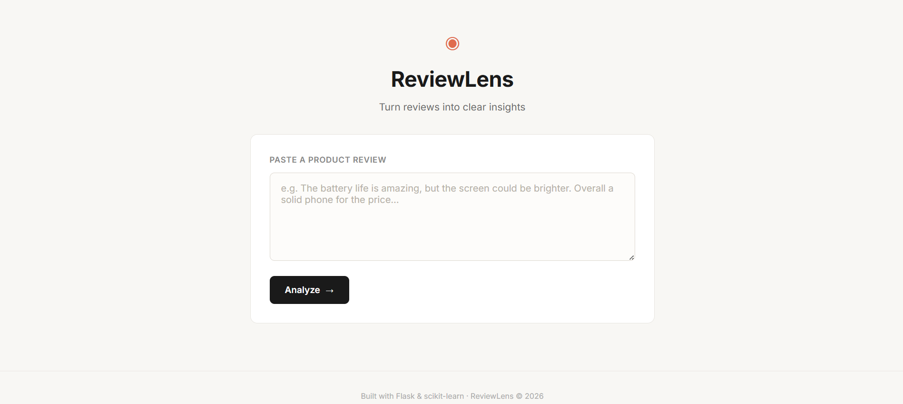
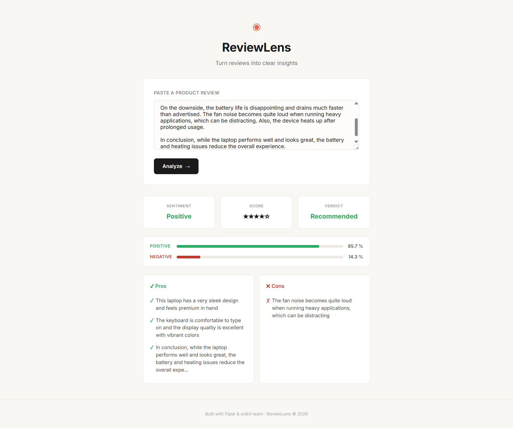

# ReviewLens: Product Insight Analyzer ◉

ReviewLens is a sophisticated, industry-grade web application designed to transform raw product reviews into actionable insights. By leveraging advanced Natural Language Processing (NLP) and Machine Learning, it provides a nuanced understanding of consumer sentiment beyond simple binary classification.

---

## 🎯 Key Features

- **Nuanced Sentiment Analysis**: Uses sentence-level prediction to handle complex, mixed, or neutral reviews with high accuracy.
- **Insightful Pros & Cons**: Automatically extracts key product strengths and weaknesses using TF-IDF keyword analysis.
- **Dynamic Scoring & Verdict**: Generates a 1–5 star score and a human-readable purchase verdict based on model confidence and sentiment ratios.
- **Premium UI/UX**: A clean, minimal, Notion-inspired interface designed for clarity and ease of use.
- **Real-time Processing**: Fast AJAX-based analysis without page reloads.

---

## 📸 Screenshots

### 1. Main Dashboard
[](screenshots/Dashboard.png)
*The clean, minimal entry point for review analysis.*

### 2. Detailed Analysis Results
[](screenshots/Results2.png)
*Showing sentiment ratios, scores, and extracted pros/cons.*

---

## 🧱 Tech Stack

- **Backend**: Python 3.x, [Flask](https://flask.palletsprojects.com/)
- **Machine Learning**: [Scikit-learn](https://scikit-learn.org/) (Logistic Regression + TF-IDF)
- **NLP**: [NLTK](https://www.nltk.org/) (Sentence Tokenization, Lemmatization, Stop-word Removal)
- **Frontend**: Semantic HTML5, Vanilla CSS3 (Custom Design System), JavaScript (ES6+ Fetch API)

---

## 🚀 Getting Started

### Prerequisites
- Python 3.8 or higher
- pip (Python package manager)

### Installation

1. **Clone the repository**:
   ```bash
   git clone https://github.com/Aravind262005/ReviewLens-.git
   cd ReviewLens-
   ```

2. **Set up a virtual environment**:
   ```bash
   python -m venv venv
   source venv/bin/activate  # On Windows use: venv\Scripts\activate
   ```

3. **Install dependencies**:
   ```bash
   pip install -r requirements.txt
   ```

4. **Download NLTK resources**:
   ```bash
   python -c "import nltk; nltk.download('punkt'); nltk.download('stopwords'); nltk.download('wordnet')"
   ```

### Running the Application

```bash
flask run
```
The application will be available at `http://127.0.0.1:5000`.

---

## 📂 Project Structure

```text
ReviewLens/
├── app.py              # Flask server & API routing
├── predict.py          # Sentiment prediction logic (Sentence-level)
├── preprocess.py       # Text cleaning & NLP pipeline
├── extractor.py        # TF-IDF based Pros/Cons extraction
├── models/
│   ├── model.pkl       # Trained Logistic Regression model
│   └── vectorizer.pkl  # TF-IDF Vectorizer
├── static/
│   └── style.css       # Custom design system & styles
├── templates/
│   └── index.html      # Main application interface
└── requirements.txt    # Project dependencies
```

---

## 🧠 How it Works

1. **Preprocessing**: Input text is cleaned by removing noise (special characters, digits), lowercasing, removing stop-words, and applying lemmatization.
2. **Sentence Analysis**: The review is tokenized into sentences. Each sentence is predicted individually to compute a **Positive Ratio**.
3. **Sentiment Logic**:
   - `Ratio > 0.7`: Positive
   - `Ratio < 0.3`: Negative
   - `0.3 - 0.7`: Mixed
4. **Keyword Extraction**: The system uses TF-IDF to identify significant words across the review, cross-referencing them with curated sentiment banks to populate Pros and Cons.

---

## 🤝 Contributing

Contributions are welcome! Please feel free to submit a Pull Request.

---

## 📄 License

This project is licensed under the MIT License - see the LICENSE file for details.

---

**Built with ❤️ by [Aravind](https://github.com/Aravind262005)**
